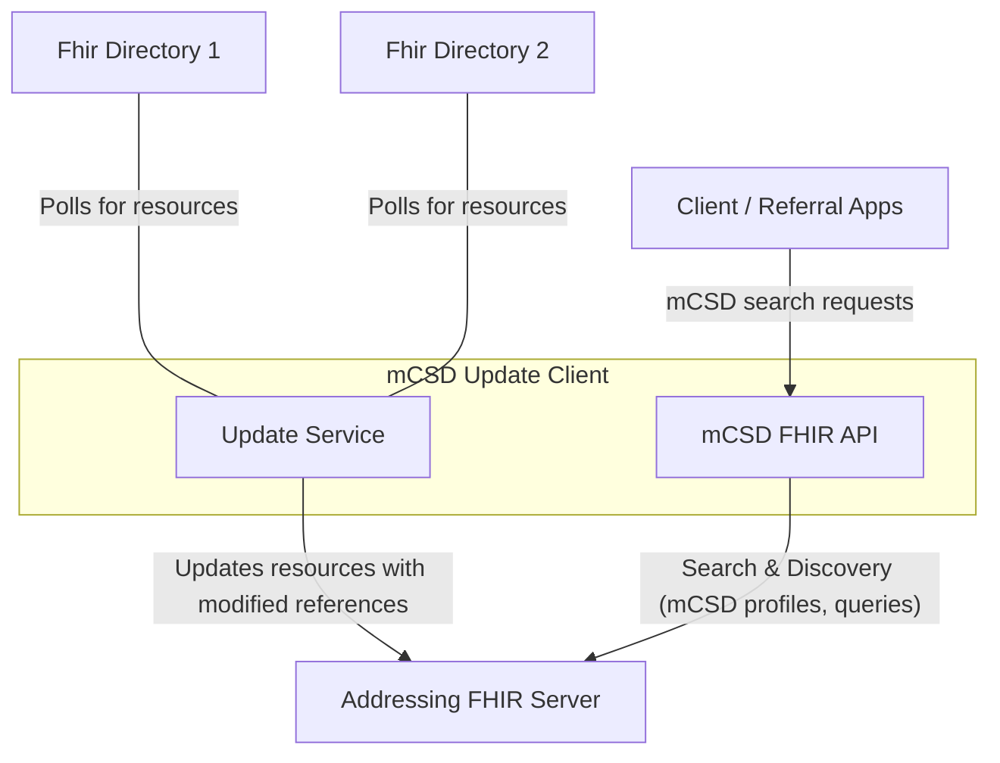
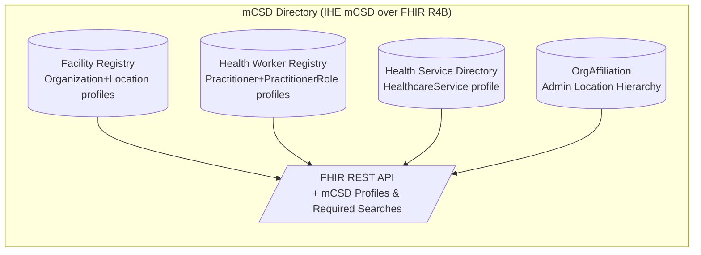

# MCSD Update client

This document explains the architecture of the MCSD update client. For actual
startup instructions in this repository, use
[`../README.md`](../README.md) and
[`../../../poc9-start-stack/README.md`](../../../poc9-start-stack/README.md).

The MCSD update client updates FHIR resources that conform to the
[mCSD specification](https://profiles.ihe.net/ITI/mCSD/volume-1.html#1-46-mobile-care-services-discovery-mcsd).
This application is an implementation of
[ITI-91](https://profiles.ihe.net/ITI/mCSD/ITI-91.html).

It continuously polls one or more source directories for mCSD resources,
rewrites internal references so they point to the addressing FHIR server, and
then updates the transformed resources on that server.



## Update service

The Update service polls one or more FHIR directories for new or updated
resources. It compares incoming data with the addressing FHIR directory and
decides which resources must be created, updated, or skipped. When an update is
needed, it namespaces internal ids and references according to the source
directory so ids do not collide and cross-resource references point to the
addressing FHIR server.

For instance, take the following Organization resource found in a directory:

```json
{
  "resourceType": "Organization",
  "id": "1",
  "name": "Good Health Clinic",
  "partOf": {
    "reference": "Organization/2"
  }
}
```

In this case, the "id" is the original logical [id](https://build.fhir.org/resource-definitions.html#Resource.id) that the directory has assigned. While the reference of "partOf" points to another Organization resource within that directory. When this resource is updated to the addressing FHIR server, the id will be namespaced and the reference will be modified to point to the addressing FHIR server instead:

```json
{
  "resourceType": "Organization",
  "id": "directory-id-1",
  "name": "Good Health Clinic",
  "partOf": {
    "reference": "http://addressing-fhir-server/Organization/directory-id-2"
  }
}
```

This creates a consistent aggregated view across multiple source directories and
avoids id conflicts between them.

### Polling for update

The update service uses a polling mechanism to periodically check one or more
FHIR directories for new or updated resources. When a resource change is
detected, the client retrieves it, rewrites internal references, and then
updates the transformed resource on the addressing server. The scheduler
triggers this process at regular intervals.

It will take care of only fetching resources that have been created or updated since the last successful poll, using the `_lastUpdated` search parameter. This ensures that the update process is efficient and only processes new or changed data.

As part of the polling process, the client can validate that the source
directory supports the required mCSD resources and interactions by checking its
CapabilityStatement at `/metadata`. If the directory does not meet those
requirements, the client logs an error and skips updates for that directory.

## mCSD FHIR API

The system exposes a FHIR API that adheres to the mCSD specification, allowing clients to perform CRUD operations on supported resources. The API supports standard HTTP methods such as GET, POST, PUT, and DELETE, and returns responses in JSON format.

In a nutshell, mCSD is a standardized way to represent and exchange information about healthcare facilities, services, and providers using FHIR resources. It defines specific profiles and search parameters to ensure interoperability between different systems.


